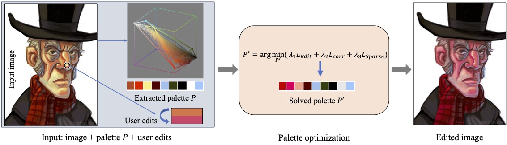
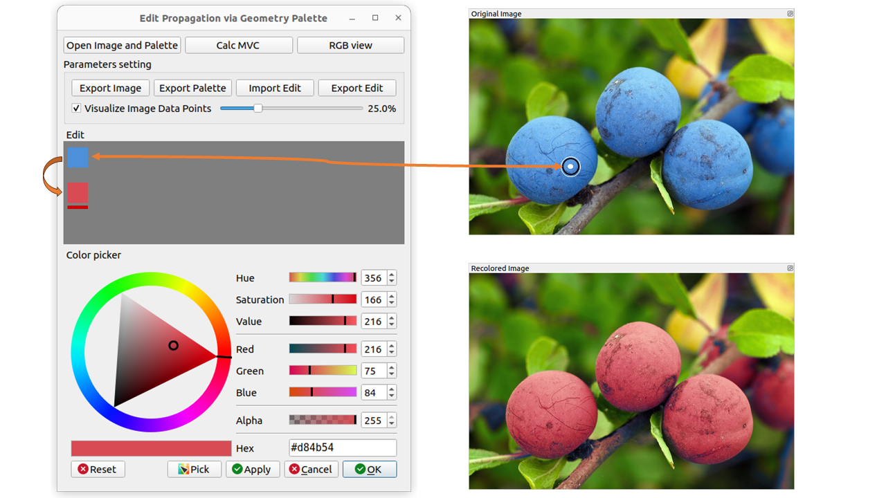

# Edit_Propagation_via_Color_Palettes

This project is implemented with a GUI interface by the author of *Edit Propagation via Color Palettes*.

This project only contains the code for calculating layer weights and recoloring based on input images and color palettes. To obtain an image color palette, please use [palette-refine](https://github.com/amberwangyili/palette-refine) or other color palette extraction methods.

## Requirements

This implementation is based on C++ 17 and CMake 3.14, and depends on the following software packages:

* OpenCV 4
* Qt 5.12
* Gurobi

When installing, please download [Qt-Color-Widgets](https://gitlab.com/mattbas/Qt-Color-Widgets) and place it in the `include/Qt-Color-Widgets` directory.

## Usage

The program allows users to load images, click `Ctrl + Left-click` on the image to obtain the color of a specific position, and use the HSV color palette for color modification to generate a recolored image.

Users can select any number of colors for modification or deletion.

At the same time, the program also allows users to observe the color changes of the color palette and the distribution of colors between the color palette and images in RGB space.
